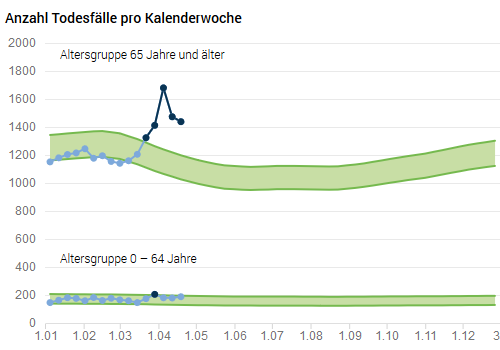

-   [Einleitung](#einleitung)
-   [Modell](#modell)
-   [Daten](#daten)
-   [Die Zahl der Toten streut wie die Jahre zuvor](#die-zahl-der-toten-streut-wie-die-jahre-zuvor)

Einleitung
------------

```{r setup, include=FALSE}
knitr::opts_chunk$set(collapse = TRUE)
```

<style>
.imageCont{display: flex; flex-direction: row; flex-wrap: wrap; max-width: 100%; align-items: center; justify-content: center}
.imageCont img {max-width: 175px; height: 100%; object-fit: cover}
.imageCont figure{margin: 0 5px; height: 175px}
</style>

Zur aktuellen COVID-19 Pandemie sind viele Methoden und Daten verfügbar, wenn auch mit einigen Unsicherheiten, sind dennoch Resultate berechenbar. Bevor eine Methode bestimmt wird ist der Prozess, wie neue Daten entstehen, und die Relationen zu bestehenden Datenbeständen zu hinterfragen. Eine releativ verlässliche Zahl ist die [laufende Erfassung der Todesfälle](https://www.bfs.admin.ch/bfs/de/home/statistiken/gesundheit/gesundheitszustand/sterblichkeit-todesursachen.html) in der Schweiz.

Modell
--------

Viele berichteten im März und April 2020 über Methoden, die helfen eine Pandemie und die Wirkung der angeordneten Massnahmen zu verstehen. Ich möchte nur einige auserwählte Arbeiten hier festhalten - sicher gibt es noch viele weitere.

* Tim Churches, Health Data Science Blog, 17.Februar 2020, Analysing COVID-19 (2019-nCoV) outbreak data with R - part 1, Verfügbar unter: https://timchurches.github.io/blog/posts/2020-02-18-analysing-covid-19-2019-ncov-outbreak-data-with-r-part-1/
* Harry Stevens, The Washingtonpost, 14.März 2020, Why outbreaks like coronavirus spread exponentially, and how to *flatten the curve*, Verfügbar unter: https://www.washingtonpost.com/graphics/2020/world/corona-simulator/
* Trung Nguyen, Medium, 30.März 2020, Germany COVID-19 social distancing simulation, Verfügbar unter: https://towardsdatascience.com/covid-19-social-distancing-simulation-f091a58732f9
* Holger Dambeck, Spiegel, 2.April 2020, Was uns die Zahl der Toten verrät, Verfügbar unter: https://www.spiegel.de/wissenschaft/medizin/corona-pandemie-was-uns-die-zahl-der-toten-verraet-a-ca5dc909-716c-44ac-806f-530a10916121
* Prof.Dr.med.Pietro Vernazza, Kantonsspital St.Gallen, 19.April 2020, Sind wir tatsächlich im Blindflug?, Verfügbar unter: https://infekt.ch/2020/04/sind-wir-tatsaechlich-im-blindflug/
* an der Heiden M, Hamouda O: Robert Koch Institut, 24.April 2020, Schätzung der aktuel- len Entwicklung der SARS-CoV-2-Epidemie in Deutsch- land – Nowcasting, Verfügbar unter: https://www.rki.de/DE/Content/Infekt/EpidBull/Archiv/2020/Ausgaben/17_20_SARS-CoV2_vorab.pdf?__blob=publicationFile
* Prof.Dr.Tanja Stadler, ETH Zürich, Department of Biosystems Science and Engineering, last update 21.April 2020, COVID-19 Pandemic and Monitoring spread in Switzerland, Verfügbar unter: https://bsse.ethz.ch/cevo/research/sars-cov-2.html


In einem **SEIR**-Modell müssen einige Daten zur Validierung vorhanden sein, beispielsweise zum Zustand *Exposed*, was Viruskontaktohne Symptome bedeutet. Gerade dieser Zustand zeigt, wie schwierig es ist an solche Daten zu kommen. Da dürfte ein gutes Design für Stichproben weiter helfen.

```{r echo=TRUE}
if (!require('DiagrammeR')) install.packages('DiagrammeR')

DiagrammeR::grViz("digraph {
  graph [layout = dot, rankdir = LR]
  
  node [shape = oval]        
  rec1 [label = 'Susceptible']
  rec2 [label = 'Exposed']
  rec3 [label = 'Infectious']
  rec4 [label =  'Recovered']

  # edge definitions with the node IDs
  rec1 -> rec2 -> rec3 -> rec4
  }", 
  height = 100)

```
*Source: https://www.idmod.org/docs/hiv/model-sir.html*

Das SEIR-Modell alleine genügt noch nicht, denn nicht alle erholen sich von selbst. Viele Erkrankte müssen hospitalisiert werden und einige sterben dennoch.

```{r echo=FALSE}

DiagrammeR::grViz("digraph {
  graph [layout = dot, rankdir = LR]
  
  node [shape = oval]        
  rec1 [label = 'Infectious']
  rec2 [label = 'Hospitalized']
  rec3 [label = 'Dead']
  rec4 [label =  'Recovered']

  # edge definitions with the node IDs
  rec1 -> rec2 -> rec3
  rec2 -> rec4
  }", 
  height = 100)

```

In zwischen wissen wir, dass hauptsächlich ältere Menschen mit einem COVID-19 Infekt sterben können. Aber gerade im zunehmenden Alter können Mehrfacherkrankungen auftreten. Da die Zahl der Toten eine relativ zuverlässige Datenquelle darstellt, stellt sich die Frage, ob eine grundsätzliche Zunahme in der Todesfallstatistik erkennbar ist?

Daten
-------

Viele Datenquellen wurden in den letzten Wochen immer wieder in den Medien erwähnt. Ich möchte nur einige auserwählte öffentliche Datenquellen hier festhalten - sicher gibt es noch viele weitere.

* [Johns Hopkins University](https://coronavirus.jhu.edu)
* [Statistisches Amt Kanton Zürich](https://www.web.statistik.zh.ch/covid19_dashboard)
* [Bundesamt für Statistik](https://www.bfs.admin.ch/bfs/de/home/aktuell/covid-19.html)
* [Bundesamt für Gesundheit](https://www.bag.admin.ch/bag/de/home/krankheiten/ausbrueche-epidemien-pandemien/aktuelle-ausbrueche-epidemien/novel-cov.html)
* [OBSAN](https://www.obsan.admin.ch/de/indikatoren/corona-risiko-vorerkrankungen-und-risikogruppe-alter-15)

Um die Zahl der Toten einordnen zu können, benötigen wir eine Statistik, die auch in den vergangenen Jahren erhoben wurde. Ein saisonaler Vergleich mit vergangenen Jahren ist hilfreich. Das Bundesamt für Statistik führt eine [laufende Erfassung der Todesfälle](https://www.bfs.admin.ch/bfs/de/home/statistiken/gesundheit/gesundheitszustand/sterblichkeit-todesursachen.html) in der Schweiz durch. 

</br>
<center>

</center>
</br>
Erfasst werden alle Todesfälle beim zuständigen Zivilstandsamt von Schweizern mit Wohnsitz in der Schweiz. Neben dem Peak im April ist auch der Verlauf im Januar und Februar auffällig. Anfangs Jahr werden weniger Todesfälle als erwartet an das BFS gemeldet.

Die Zahl der Toten streut wie die Jahre zuvor
---------------------------------------------

Die gemeldeten Todesfälle im März und April 2020 liegen zwar weit über dem 95%-Konfidenzinterval, aber die Grippewelle hat auch in den vergangenen Jahren zu grossen Zahlen geführt. Vor vier Jahren, im Jahr 2016, wurde das letzte mal in den Monaten Januar und Februar so wenige Todesfälle wie im 2020 gemeldet. In den Jahren 2017 bis 2019 waren die gemeldeten Todesfälle im Winter höher als 2020.
</br>

<div class='imageCont'>
```{r echo=F}
blogdown::shortcode("figure", src="gd-d-14.03.04.03-wr-computed_thumbnail.png")
blogdown::shortcode("figure", src="gr-d-14.03.04wr_2019-computed_thumbnail.png")
blogdown::shortcode("figure", src="gr-d-14.03.04wr_2018-computed_thumbnail.png")
blogdown::shortcode("figure", src="gr-d-14.03.04wr_2017-computed_thumbnail.png")
blogdown::shortcode("figure", src="gr-d-14.03.04wr_2016-computed_thumbnail.png")
blogdown::shortcode("figure", src="gr-d-14.03.04wr_2015-computed_thumbnail.png")
blogdown::shortcode("figure", src="gr-d-14.03.04wr_2014-computed_thumbnail.png")
blogdown::shortcode("figure", src="gr-d-14.03.04wr_2013-computed_thumbnail.png")
blogdown::shortcode("figure", src="gr-d-14.03.04wr_2003-computed_thumbnail.png")
#blogdown::shortcode("figure", src="gr-d-14.03.04wr_1983-computed_thumbnail.png")
```
</div
</br>


Aufgrund des Bevölkerungswachstums in der Schweiz, sterben jedes Jahr mehr Menschen. Dies wiederspegelt sich im jährlichen Erwartungswert vom Bundesamt für Statistik (Mitte des grünen Bandes). 

</br>
```{r results='asis',warning=F, echo=F, fig.align="center", fig.width=7, fig.height=5, fig.cap="Datenquelle: BFS, Grafik by Norman Bieri"}

blogdown::shortcode("figure", src="erwartungskurve.png", alt="Erwartete Todesfälle von Schweizer über 65 Jahre in den Jahren 2010 bis 2020 steigt stetig.")
```
</br>


Die Summe aller erfassten Todesfälle im Jahr 2020 liegt im Bereich des Erwartungswerts. Das Bundesamt für Statistik hat zwischen dem 1.Januar und dem 28.April 2020 nicht mit weniger Todesfällen gerechnet.

</br>

```{r results='asis',warning=F, echo=F, fig.align="center", fig.width=7, fig.height=5, fig.cap="Datenquelle: BFS, Grafik by Norman Bieri"}

blogdown::shortcode("figure", src="sollundist.png", alt="Erfasste und erwartete Todesfälle von Schweizer über 65 Jahre in den Jahren 2010 bis 2020.")
```
</br>

Jährlich erfasste Todesfälle bis zur Kalenderwoche 16 bleiben konstant seit 2017.

</br>
```{r results='asis',warning=F, echo=F, fig.align="center", fig.width=7, fig.height=5, fig.cap="Datenquelle: BFS, Grafik by Norman Bieri"}

blogdown::shortcode("figure", src="sollundistcum.png", 
                    alt="Erfasste Todesfälle von Schweizer über 65 Jahre in den Jahren 2010 bis 2020 zeigen keine Auffälligkeit.",
                    caption="Datenquelle: BFS, Grafik by Norman Bieri")
```
