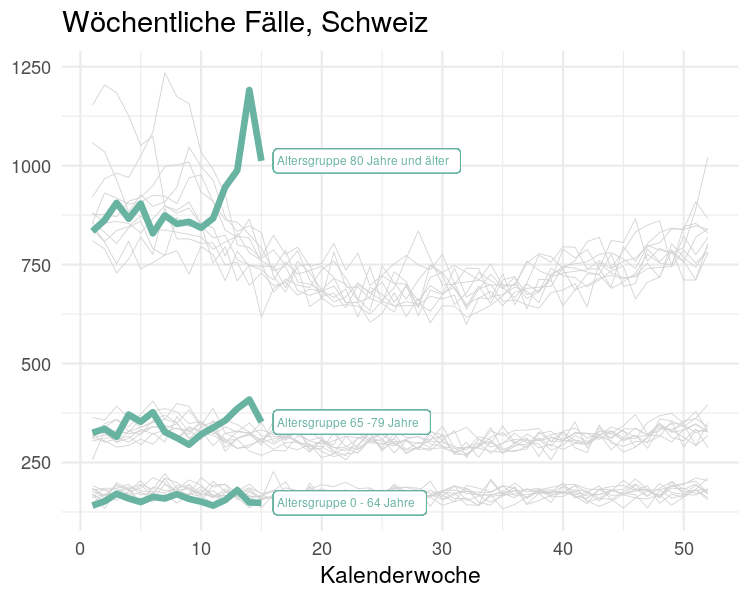
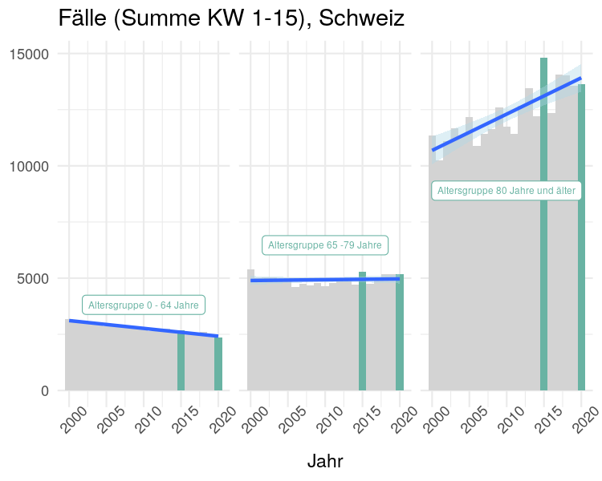
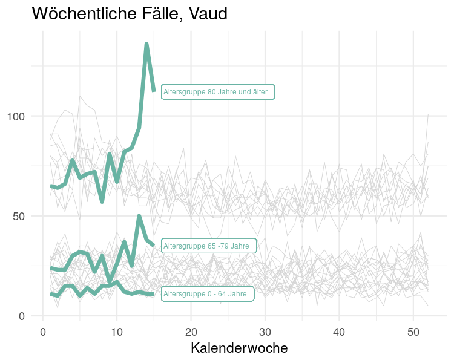
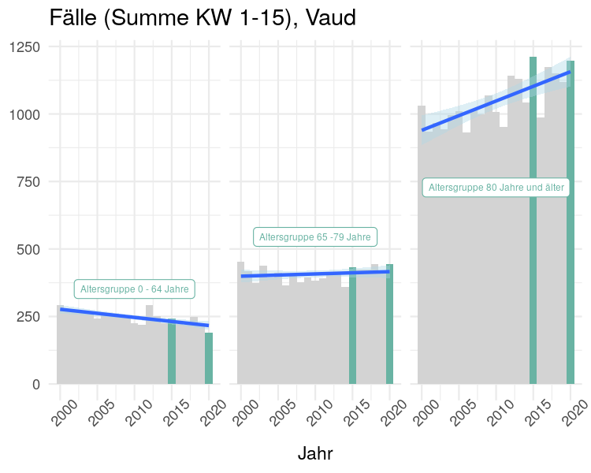
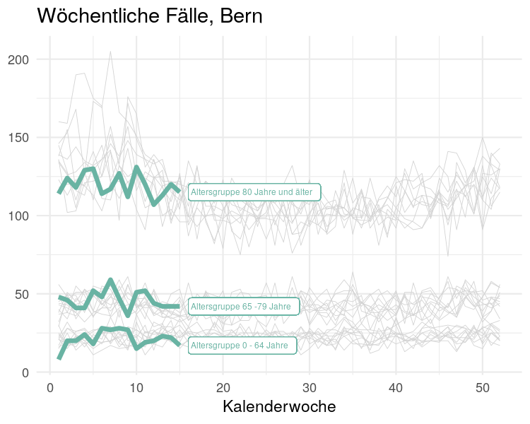
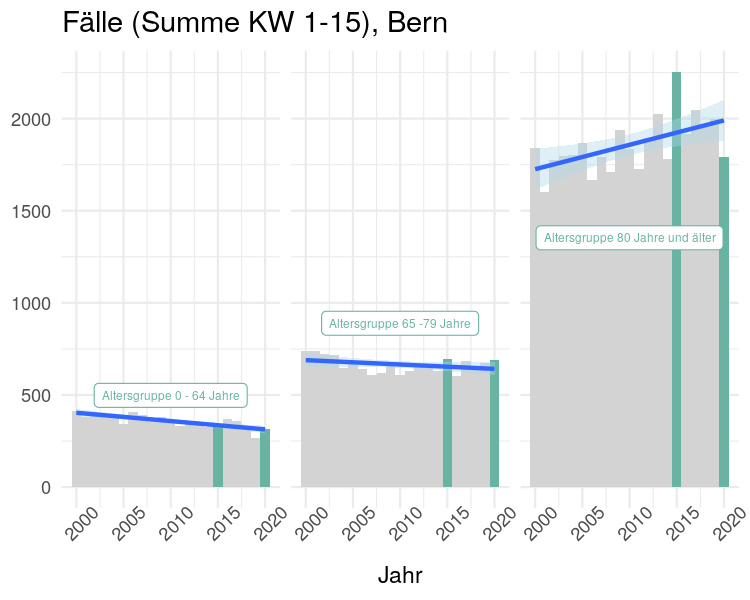
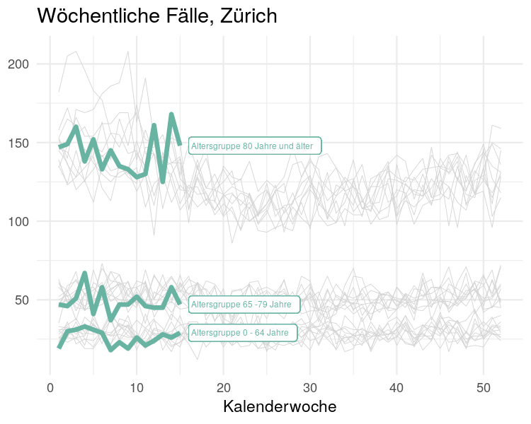
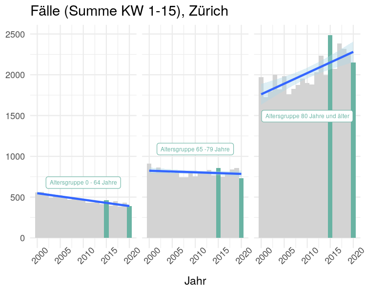

-   [Einleitung](#einleitung)
-   [Drei Altersgruppen](#drei-altersgruppen)
-   [Regionale Unterschiede](#regionale-unterschiede)

Einleitung
------------

```{r setup, include=FALSE}
knitr::opts_chunk$set(collapse = TRUE)
```

Die aktiven Senioren sind ein wichtiges Gästesegment im Schweizer Tourismus und sie werden zukünftig beim generellem Wiederaufbau der Wirtschaft eine zentrale Rolle einnehmen. Eine zielführende Kommunikation in der Schweiz ist jetzt um so wichtiger.

Folgend gehe ich auf die [Grafik vom Bundesamt für Statistik (BFS)](https://www.bfs.admin.ch/bfs/de/home/statistiken/gesundheit/gesundheitszustand/sterblichkeit-todesursachen.html) ein und was sie dem Leser mitteilt. Anschliessend zeige ich Diagramme basierend auf Daten vom BFS eingeteilt in drei Altersgruppen und nach Kanton.


# Die Kommunikation vom Bundesamt

Vor einer Woche habe ich beschrieben, warum die [Die Zahl der Toten](/de/2020/04/22/die-zahl-der-toten/) eine relativ zuverlässige Datenerfassung ist. Zudem konnte ich zeigen, dass es in der Schweiz seit 2013 immer wieder zu einer Übersterblichkeit während der Wintersaison kam. 

```{r fig-1, echo=F, out.width = "50%", fig.cap='Wöchentlich Todesfälle'}
knitr::include_graphics("gd-d-14.03.04.03-wr-computed_thumbnail.png")
```

Vergleichbar mit einer geplanten Bundesstrasse gibt die Abbildung \@ref(fig:fig-1) über die wöchentlichen erfassten Todesfälle vom Bundesamt für Statistik markant grün eingefärbt mit Leitplanken vor, wie die zukünftigen Anzahl Todesfälle pro Kalenderwoche zu verlaufen haben. Dabei werden Regionen, Alter und Jahreszeiten zu wenig berücksichtigt!

Insbesondere hat die Altersgruppe *über 65* zu wenig Aussagekraft. Schweizer haben heute eine Lebenserwartung von über 80 Jahren. Auch wenn Arbeitnehmer mit 65 Jahren in der Regel in den Ruhestand gehen, ist für die aktiven Senioren über mehrere Jahre nicht mit dem Tod zu rechnen.

Drei Altersgruppen
------------------

Ich will zeigen, dass kumulierte Fallzahlen klassiert in drei Altersgruppen mehr Aussagekraft und Zuversicht vermitteln.

```{r fig-2, echo=F, out.width=c('50%', '50%'), fig.show='hold', fig.cap='Todesfälle im Verlauf und kummuliert bis Kalenderwoche 15'}


```

Im Liniendiagramm in der Abbildung \@ref(fig:fig-2) ist der Verlauf der letzten 10 Jahre grau hinterlegt. Für die beiden Altersgruppen *0-64* und *65-79* werden ähnliche Bandbreite von rund 50 Fällen erkennbar, hingegen für die Altersgruppe *80+* ist die Bandbreite ein Mehrfaches. Insbesondere im ersten Quartal und im Dezember scheint die Streuung um einiges grösser zu sein, was in der BFS-Abbildung nicht erkennbar wird. Die Bundesstrasse erscheint (Abb. \@ref(fig:fig-1)) immer gleich breit für 52 Kalenderwochen.

Eine Abhängigkeit von der Jahreszeit zeigen sich vor allem in der Altersgruppe *80+* und nur leicht bei den *65-79* Jährigen. Auch diese Tatsache verbirgt sich in der BFS-Abbildung \@ref(fig:fig-1), denn für die Altersgruppe *über 80 Jahren* ist die Wahrscheinlichkeit im Winter zu sterben um einiges grösser als vom BFS dargestellt.

Ausschliesslich in der Altersgruppe über 80 zeigen sich über die Jahre im Winter extreme Todesfallzahlen. Im Jahr [**2015 erfasste eine starke Grippewelle**](https://www.bfs.admin.ch/bfs/de/home/statistiken/gesundheit/gesundheitszustand/sterblichkeit-todesursachen.assetdetail.3742835.html) die Schweiz, dabei wurden in den ersten 15 Kalenderwochen mehr Todesfälle verzeichnet als im 2020.

Im Balkendiagramm in der Abbildung \@ref(fig:fig-2) sind die Unterschiede in der Streuung zwischen den Altersgruppen markant. In der Altersgruppe über 80 Jahre scheint eine Wellenbewegung über die zwanzig Jahre normal. Hingegen **in der Altersgruppe *65-79* ist die Todesfallzahl der letzten 20 Jahre nahezu konstant**.

Ausserdem zeichnet sich bei den Berufstätigen ein stetiger Rückgang ab. Im Jahr 2020 liegen die Fallzahlen auf tiefstem Niveau seit 20 Jahren. Daraus folgt, dass die Fallzahlen bei den Nicht-Berufstätigen steigen müssen oder sie erscheinen in der Statistik über Auslandschweizer. Gemäss Bundesamt für Statistik leben aktuell rund 0.8 Mio [Schweizer im Ausland](https://www.bfs.admin.ch/bfs/de/home/statistiken/bevoelkerung/migration-integration/auslandschweizer.html) und gemäss SRF [wächst die Auslandschweizergemeinde jährlich im Schnitt um fast 12'000 Personen](https://www.srf.ch/news/schweiz/zahl-der-auslandschweizer-der-viertgroesste-kanton).

Regionale Unterschiede
----------------------

Das BFS bietet detaillierte Daten nach Alter und Regionen über die letzten zwanzig Jahre und seit dem 28.April 2020 ein [Mortalitätsmonitoring nach Grossregionen](https://www.experimental.bfs.admin.ch/expstat/de/home/innovative-methoden/momo.html). Die Zahlen des Mortalitätsmonitorings basieren auf den täglichen Zivilstandmeldungen, wobei in der Regel nach neun Tagen ein genügend grosser Anteil (> 85%) der Todesfälle registriert, sodass die Schätzung der tatsächlichen Zahl der Todesfälle auf einer breiten Datenbasis möglich ist. 

Im Folgenden wählte ich für eine Gegenüberstellung die drei bevölkerungsstärksten Kantone: Vaud, Bern und Zürich.

```{r fig-3, echo=F, out.width=c('50%', '50%'), fig.show='hold', fig.cap='Todesfälle im Verlauf und kummuliert bis Kalenderwoche 15'}






```

*Note: Die y-Achse ist für jeden Kanton einzeln skaliert !!*

Im Balkendiagramm in Abbildung \@ref(fig:fig-3) sind in der Altersgruppe *64-79* nur geringe Unterschiede zu erkennen. Aller drei Kantone zeigen eine nahezu konstante Todesfallzahl über die letzten 20 Jahre. 

Kantonale Unterschied sind in der Altersgruppe *80 Jahre und älter* zu erkennen, jedoch war der Unterschied auch in den letzten 5 Jahren da. Es scheint als, ob die Wellenbewegung in den drei Kantonen Vaud, Bern und Zürich nicht synchron laufen.

Die Zahl der Toten lassen uns keine besorgniserregende Trends erkennen - weder in einer bestimmten Altersgruppe noch regional. **Wir müssen zuversichtlicher kommunizieren.**

