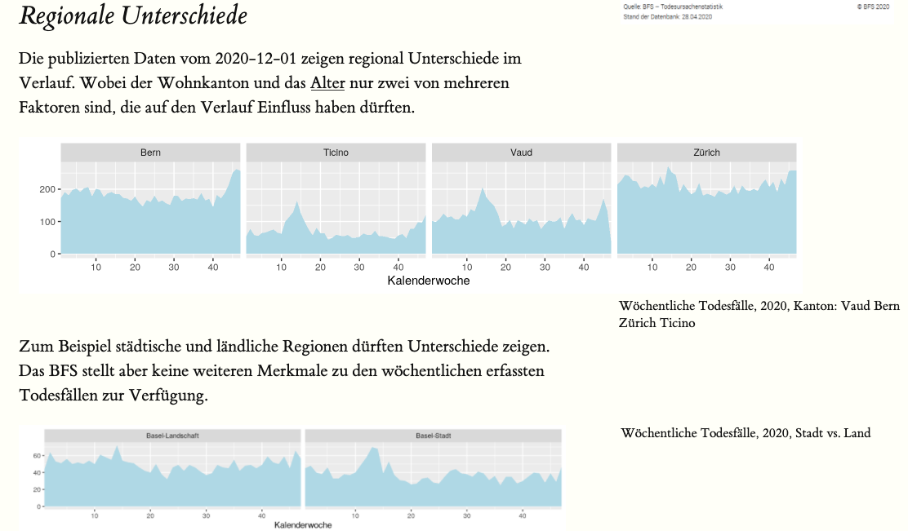

-   [Einleitung](#einleitung)
-   [Software Architektur](#software-architektur)
-   [Beispiel: Mortalitätsmonitoring](#beispiel-mortalitätsmonitoring)

Einleitung
------------

Um eine Datenquelle für ein Projekt verwenden können, ist ein Überblick für die grobe Einordnung zwingend. 
Nichts ärgerlicher als mit viel Aufwand erfahren müssen, dass in den Daten die gesuchten Informationen fehlen. Noch ärgerlicher wäre unter Zeitdruck nicht zu realisieren, dass die gesuchten Informationen vorhanden wären.

Ein `Microservice` hat nur eine Aufgabe --- er stellt ein Überblick der Datenquelle zu Verfügung. Das kann eine Tabelle, Metadaten oder eine Beschreibung sein. Einige Anwender bevorzugen Grafiken, Charts oder Dashboards. Zudem ist ein Interface zur Datenquelle zwingend (`RESTfull` Service).

Halten Sie die Microservice (MS) simpel und RESTfull, dann können Sie für komplexe Projekte viele MS aneinander koppeln. In Ihrem nächsten Projekt verwenden Sie bestehende MS wieder und ergänzen sie mit neuen. Zudem bauen sie damit gleich die Basis für ihre Dokumentation (beispielsweise können sie mit Hilfe von [Bookdown](https://bookdown.org) ihre Überlegungen zu den Daten beschreiben). 

Das Vorgehen mit Microservice ist nachhaltig, weil Sie auch später nachvollziehen können, wie die Daten zustande gekommen sind.

Software Architektur
--------------------

Schlussendlich ist der `Microservice` ein einfacher Webserver auf den via URL zugegriffen werden kann.
Wenn immer möglich werden statische Webseiten verwendet. Für das Rendern statischer Webseiten existieren heute schnelle Programme, wie
[{width=15%}](https://gohugo.io).
Falls Sie eine Datenquelle benutzen, die periodisch aktualisiert wird, benötigen Sie einen Server auf dem periodisch die Datenquelle abgefragt, überprüft und den eigenen Microservice aktualisiert. Dafür und für vieles mehr stellt beispielsweise
[{width=5%}GitHub](https://github.com) 
oder
[{width=15%}](https://gitlab.com)
ihren CI/CD Service zur Verfügung.

[{width=10%}](https://www.r-project.org)
ist `Opensource` Statistiksoftware und bietet eine geeignete Entwicklungsumgebung für alles, was mit Daten zu tun hat. Enthalten ist auch [R Markdown](https://rmarkdown.rstudio.com), womit Webseiten erstellt werden können.

Jeder Microservice ist unabhängig und wird einzig über seine `REST` Schnittstelle definiert. Um die Entwicklungsumgebung auch unabhängig zu halten, eignet sich
[{width=10%}](https://www.docker.com)
und für R-Projekte im Speziellen [Rocker](https://www.rocker-project.org).

Beispiel: Mortalitätsmonitoring
-------------------------------

Das Mortalitätsmonitoring (MOMO) überwacht die wöchentliche Anzahl Todesfälle in der Schweiz.
Die Todesfälle werden täglich den Zivilstandsämtern gemeldet und dem 
[Bundesamt für Statistik](https://www.bfs.admin.ch/bfs/de/home/statistiken/bevoelkerung/geburten-todesfaelle/todesfaelle.html)
im Rahmen der Statistik der natürlichen Bevölkerungsbewegung (BEVNAT) mitgeteilt. 
Der Melde- und Verarbeitungsprozess dauert in der Regel neun Tage.

Seit zwanzig Jahren werden in der Schweiz wöchentlich die Todesfälle erhoben und die `Opendata` stehen im Web zur Verfügung. Das Bundesamt stellte Ende April,  nach den COVID19 Meldungen aus dem Tessin, folgende Grafik ins Internet.

 

[{width=540px}](https://www.bfs.admin.ch/bfs/de/home/statistiken/gesundheit/gesundheitszustand/sterblichkeit-todesursachen.html)

>Die Grafik oben zeigt eine massive Übersterblichkeit im April 2020. Jedoch ist sie weder neutral noch transparent und ist vielleicht für mein Projekt mehr irreleitend als hilfreich.

# Micorservice 1

Ein eigener Service, der die aktuellen Daten in Relation zu anderen Jahren und für spezifische Regionen zeigt, könnte für mein Projekt hilfreicher sein.

[{width=540px}](https://norman-ds.github.io/momo/)

Das [Mortalitäsmonitoring](https://norman-ds.github.io/momo/) läuft auf
[{width=5%}GitHub](https://github.com) 
und zeigt grafisch eine Zeitreihe für die ganze Schweiz sowie ausgewählte Kantone. Das interaktive Widget mit [dygraphs](https://dygraphs.com) ermöglicht ein Drill-Down in die Zeitreihe. Mehrere *Tabs* ermöglichen einige Zusatzinformationen zur Datenquelle anzuzeigen und die `REST`-Schnittstelle wird im *json* Format angeboten. Weil die Webseite einfach gehalten ist, wird für das Rendern [R Markdown](https://rmarkdown.rstudio.com) mit [Pandoc](https://pandoc.org) verwendet.  

# Micorservice 2

Auf diesem `Microservice` können weitere aufbauen, beispielsweise ein [Reporting](https://norman-ds.gitlab.io/report-momo/). Als Beispiel wurde hier, unabhängig und ein ganz eigenes System, das Reporting auf
[{width=15%}](https://gitlab.com)
aufgebaut.

[{width=540px}](https://norman-ds.gitlab.io/report-momo/)

Da das Mortalitätsmonitoring ausschliesslich `Opendata` benutzt, wurde dafür kostenlose Software eingesetzt. So stehen Ihnen Webserver zur Verfügung, für die ihre IT-Abteilung keinen Unterhalt betreiben muss. Sie können später entscheiden, wie viel Kosten sie für Sicherheit aufwenden wollen.

